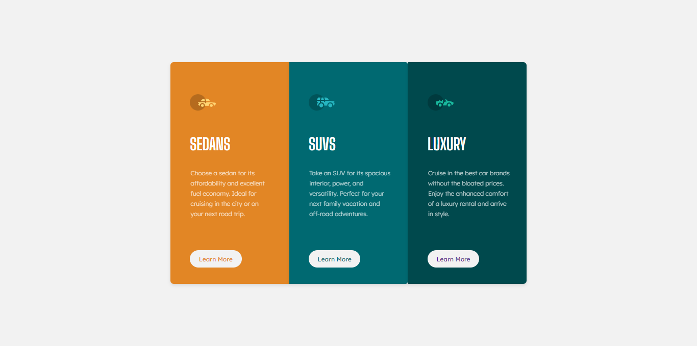
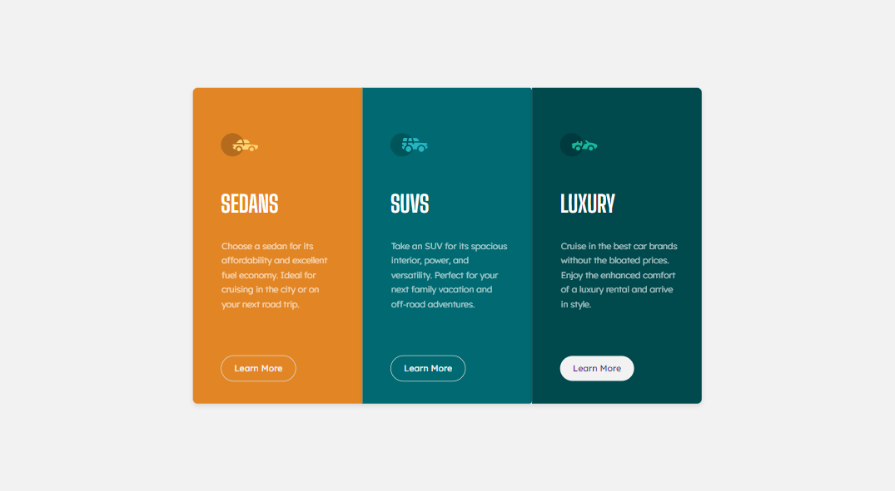
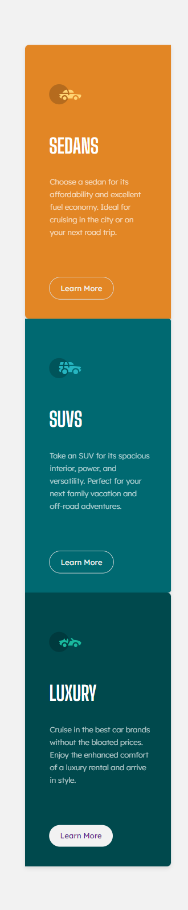

# Frontend Mentor - 3-column Preview Card Component


## Welcome! 👋

Thanks for checking out this front-end coding challenge.

This is a solution to the **3-column Preview Card Component** challenge on [Frontend Mentor](https://www.frontendmentor.io). Frontend Mentor challenges help you improve your coding skills by building realistic projects.

## Table of Contents

- [Overview](#overview)
  - [The challenge](#the-challenge)
  - [Screenshot](#screenshot)
  - [Links](#links)
- [My process](#my-process)
  - [Built with](#built-with)
  - [What I learned](#what-i-learned)

## Overview

### The challenge

Your users should be able to:

- View the optimal layout depending on their device's screen size
- See hover states for interactive elements

### Screenshot

#### Desktop


#### Desktop - Active


#### Mobile


### Links

- Solution URL: [GitHub Repository](https://github.com/harisdev-netizen/3-column-preview-cards)
- Live Site URL: [Live Preview](https://columns-preview.netlify.app/)

## My process

### Built with

- Semantic HTML5 markup
- CSS custom properties
- Flexbox
- CSS Grid

### What I learned

I am particularly proud of how I implemented the styles for the cards in this project. I used Flexbox to ensure that the layout is responsive and works well on different screen sizes. I also customized the hover effects for the buttons to create a smooth transition effect. Here's a snippet of the code I am proud of:

For example:

```css
.card a:hover {
  background: transparent;
  transition: background-color 0.3s;
  color: #f2f2f2;
  border: 1px solid #ddd;
}

.sedan {
  background-color: #E28625;
  border-radius: 8px 0 0 8px;
}

.suv {
  background-color: #006971;
  border-radius: 0 5px 5px 0;
}

.luxury {
  background-color: #00494d;
  border-radius: 0 8px 8px 0;
}
```

The above code snippet demonstrates how I styled each card with different background colors and applied rounded corners based on their positions. I also used transitions to enhance the interactivity of the button elements.
